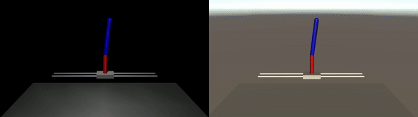
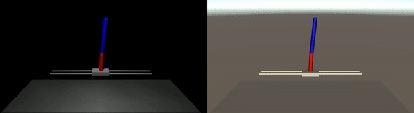

# MuJoCo Physics + Unity ML-Agents for RL task

The overall goal is to prove the capability of an agent which is trained with [MuJoCo physics engine](https://mujoco.org/), within [Unity](https://unity.com/kr) rendering setting. 

Specifically, this repository aims to show that an agent trained with MuJoCo physics engine can be converted to `.onnx` file, and then successfully resolve physics-informed task in Unity. 

- Import MuJoCo assets into Unity
- Apply MuJoCo physics engine into Unity and implement RL environment using [ML-Agents](https://github.com/Unity-Technologies/ml-agents.git)
- Import `.onnx` agent into Unity
- Check capability of an agent trained with MuJoCo in Unity

## Project Spec

- Unity 2023.2.19f1 ([how to install](https://unity.com/kr/download#how-to-get-started))
- ml-agents 2.3.0-exp3 ([how to install](https://github.com/Unity-Technologies/ml-agents/blob/develop/docs/Installation.md))
- mujoco-unity plugin 3.1.6 ([how to install](https://mujoco.readthedocs.io/en/latest/unity.html#installation-instructions))

## Task Information

This repository implements Inverted Double Pendulum task. 

An episode starts from upright double pendulums. 
The objective of the task is keeping the double pendulum upright. 

Visualization of the task is shown below. 
The left one is visualization of simulation in MuJoCo, and the right one is that of simulation in Unity. 

without trained agent (left: MuJoCo, right: Unity)

For visualization with trained agent, MuJoCo used its own trained parameters and Unity used translated agent (`.onnx` file) for simulation. 

with trained agent (left: MuJoCo, right: Unity)

It can be seen that an agent trained on MuJoCo can be utilized in Unity, which imports ML-Agents and MuJoCo-Unity plugin. 

### Observations

|Observation|Min|Max|Unit|
|-|-|-|-|
|sin value of hinge 1|-1|1|-|
|cos value of hinge 1|-1|1|-|
|angular velocity of hinge 1|-Inf|Inf|angle (rad)|
|sin value of hinge 2|-1|1|-|
|cos value of hinge 2|-1|1|-|
|angular velocity of hinge 2|-Inf|Inf|angle (rad)|
|x-coordinate of slide|-1|1|position (m)|
|x-velocity of slide|-Inf|Inf|velocity (m/s)|

### Actions

|Action|Min|Max|Unit|
|-|-|-|-|
|force to the slide|-10|10|force (N)|

### Rewards

Desired rewards are described below, but not implemented yet. 
(Please ignore the reward function now. )

- alive bonus: 10.0 points every timestep for surviving
- distance_penalty: distance between the tip of the double pendulum and desired ground truth position
- velocity_penalty: penalty for rapid move of slide
- control_penalty: penalty for extensive control

## Core Files

- [SampleScene.unity](./Assets/Scenes/SampleScene.unity): you can open this file to edit and run simulation in Unity
- [inverted_double_pendulum.xml](./mujoco_scenes/inverted_double_pendulum.xml): an `.xml` format MJCF file that is used in MuJoCo, and also imported by Unity
- [inverted_double_pendulum.onnx](./Assets/models/inverted_double_pendulum.onnx): an agent that is trained in MuJoCo, then converted to `.onnx` format
- [scripts](./Assets/scripts/): Unity scripts for observations, actions, and rewards of the task

## Acknowledges

This repository is inspired by [mj-unity-tutorial](https://github.com/Balint-H/mj-unity-tutorial.git). 
